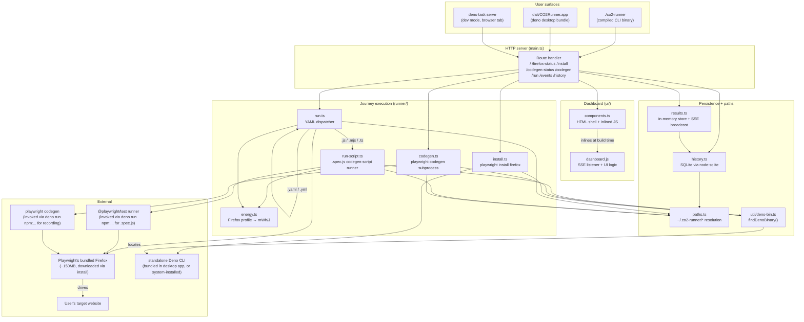
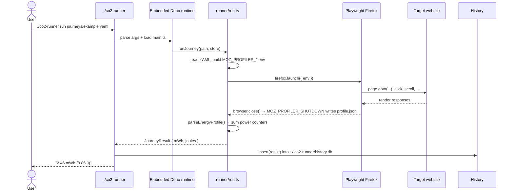
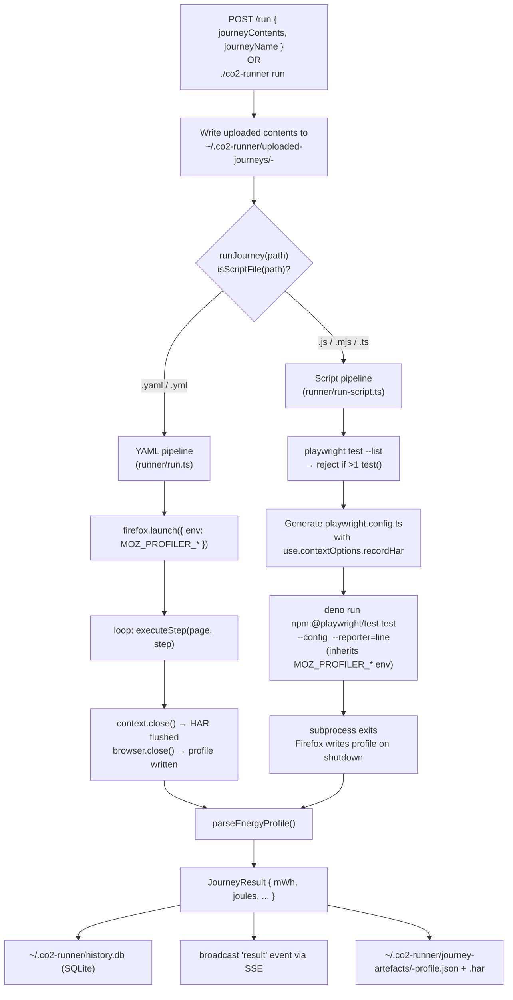
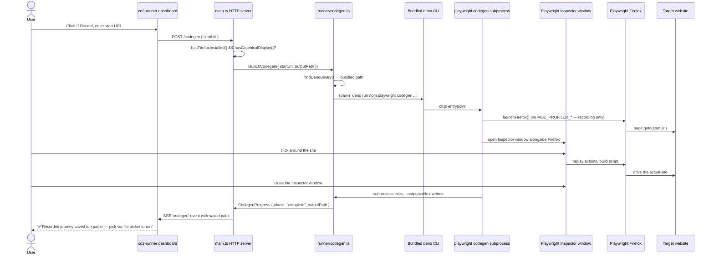
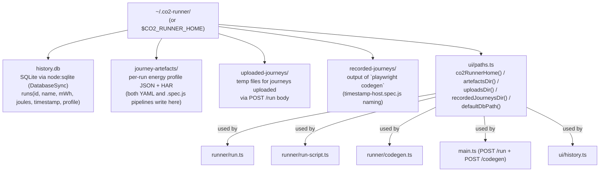
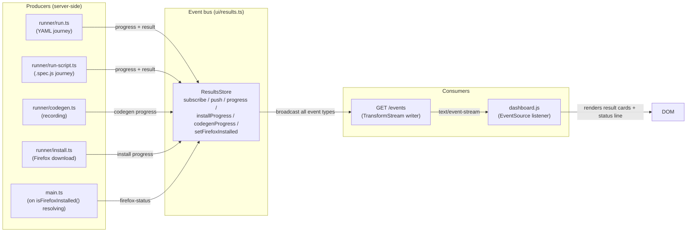
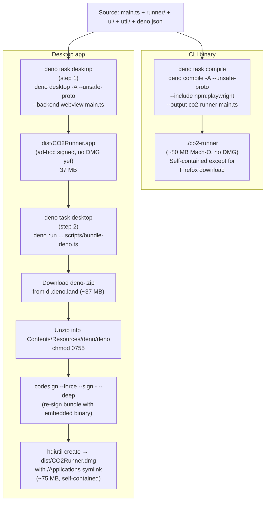
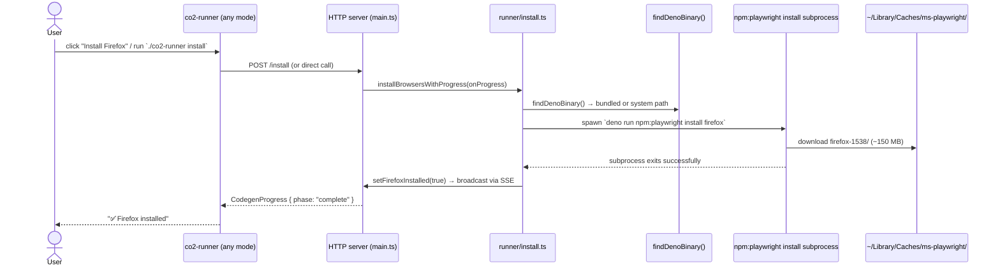
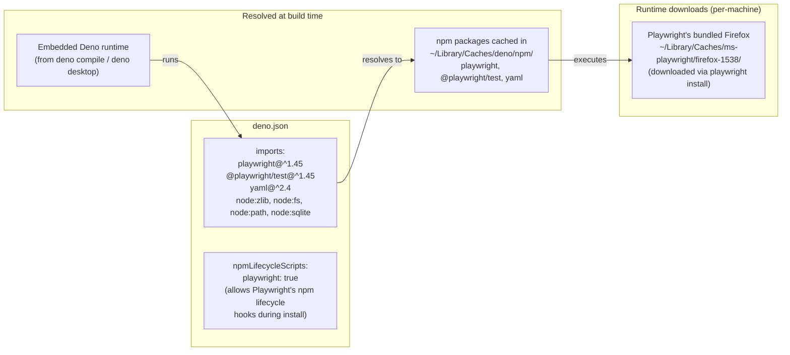
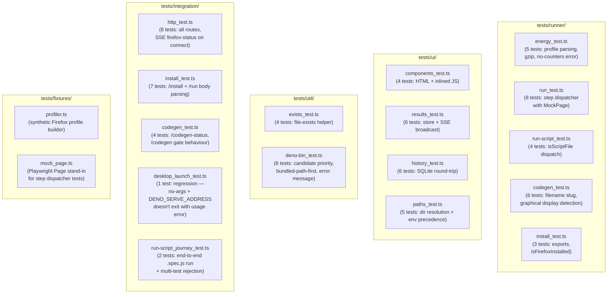

# Architecture

This document describes the high-level architecture of `co2-runner` — how the
major components fit together, where state lives, and how the two modes (CLI
binary + desktop app) share a server-side core.

## Components at a glance



## Mode 1: Compiled CLI binary

`deno task compile` produces a single ~80 MB Mach-O executable (`./co2-runner`)
that bundles the Deno runtime + all TypeScript + npm dependencies (Playwright,
YAML parser, node:sqlite). The user runs subcommands directly:



No subprocess spawn is needed for `.yaml` journeys — the embedded Deno runtime
imports `playwright` directly and calls `firefox.launch()` in-process.

## Mode 2: Desktop app (`deno task desktop`)

`deno task desktop` produces `dist/CO2Runner.dmg` — a macOS app bundle
containing:

```mermaid
graph LR
    subgraph "CO2Runner.app"
        subgraph "Contents/MacOS/"
            LW["laufey_webview<br/>(system webview host)"]
            LIBRT["libruntime.dylib<br/>(Deno runtime)"]
        end
        subgraph "Contents/Resources/"
            BUNDLED["deno/<br/>bundled standalone Deno CLI<br/>(~77 MB)"]
        end
    end

    LW -->|loads| LIBRT
    LIBRT -->|imports| MAIN["main.ts<br/>(route handler + Deno.serve)"]
    MAIN -->|spawns subprocess via<br/>findDenoBinary()| BUNDLED
```

When the user double-clicks the app:

1. `laufey_webview` launches (the system webview's host process).
2. `laufey_webview` loads `libruntime.dylib` — the embedded Deno runtime that
   runs the co2-runner HTTP server (`Deno.serve()` in `main.ts`).
3. `laufey_webview` opens a native window and points it at the HTTP server (the
   address is set via `DENO_SERVE_ADDRESS`).
4. The dashboard HTML + inlined `dashboard.js` loads in the webview.
5. The user clicks "Record" / "Install" / "Run" → the server spawns a subprocess
   using the **bundled** `deno` binary at `Contents/Resources/deno/deno` (see
   ADR 004 for why this matters).

## Journey formats + dispatcher

Two supported journey formats, routed by file extension via the dispatcher in
`runner/run.ts`:



Both pipelines produce the same `JourneyResult` shape, write artefacts to the
same `~/.co2-runner/journey-artefacts/` directory, and persist to the same
`~/.co2-runner/history.db`. Downstream tooling that consumes the HAR or the
history doesn't need to know which format produced it.

## Codegen flow (recording a new journey)



The recorded `.spec.js` is a real `playwright codegen` output file. The user
picks it via the existing file picker to run it through the script pipeline
shown above — uniform treatment for recorded vs externally-recorded scripts.

## State + persistence

All persistent state lives under `~/.co2-runner/` (or `$CO2_RUNNER_HOME` if the
user overrides):



### Why `~/.co2-runner/`, not the repo's directory

Compiled binaries (both CLI and desktop) run with an unpredictable working
directory. Relative paths like `"journey-artefacts/"` were originally used and
broke when:

- The CLI binary was invoked from a non-repo directory.
- The desktop app was launched via Finder (cwd is `/`).

The `ui/paths.ts` helper resolves all paths against `$CO2_RUNNER_HOME` (default
`~/.co2-runner/`), ensuring both modes

- the dev server all write to the same place.

## In-memory event bus (SSE)

The server pushes live events to UI clients via a Server-Sent Events stream on
`/events`. The `ResultsStore` (in `ui/results.ts`) is the in-memory pub-sub bus:



Event types in the bus: `result`, `progress`, `install`, `codegen`,
`firefox-status`. Subscribers receive every event type and dispatch on
`event.type` in the handler.

## Build pipeline



Two key flags are baked into both binaries at compile time:

- **`-A`** — grants all runtime permissions (file, env, net, run). Compiled
  binaries don't honor per-flag permission prompts; a future improvement would
  scope these to the minimal set.
- **`--unsafe-proto`** — restores `Object.prototype.__proto__` assignment. Deno
  2.9 disables it by default; Playwright's internal object model depends on it
  (see README caveats). Without this flag, the browser launches but stalls on
  the first interaction.

## Firefox install (one-time per machine)

Playwright's bundled Firefox (~150 MB) is too large to embed in the binary. It's
downloaded on first use via the `install` subcommand:



The same `findDenoBinary()` helper powers codegen, install, and the `.spec.js`
runner — see ADR 004 for why this exists + why the bundled binary is checked
first.

## Versions + dep tracking



The Playwright version pinned in `deno.json` determines both the Firefox build
number (e.g. `firefox-1538`) and the `@playwright/test` runner version. These
must stay in sync — a Playwright upgrade typically requires re-downloading
Firefox (the build number changes).

## Test layout



## Cross-references

- **ADRs**: `docs/adrs/` for the rationale behind major decisions.
  - ADR 001: HTML syntax highlighting in template literals
  - ADR 002: Support Playwright codegen scripts (.spec.js) as a journey format
  - ADR 003: Integrate `playwright codegen` into the app
  - ADR 004: Bundle standalone Deno CLI into the desktop app
- **Plan**: `plan.md` for the phased implementation history.
- **README**: `README.md` for usage + caveats from an end-user perspective.
